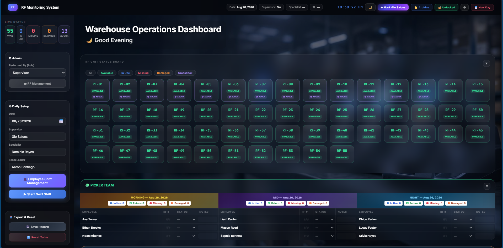
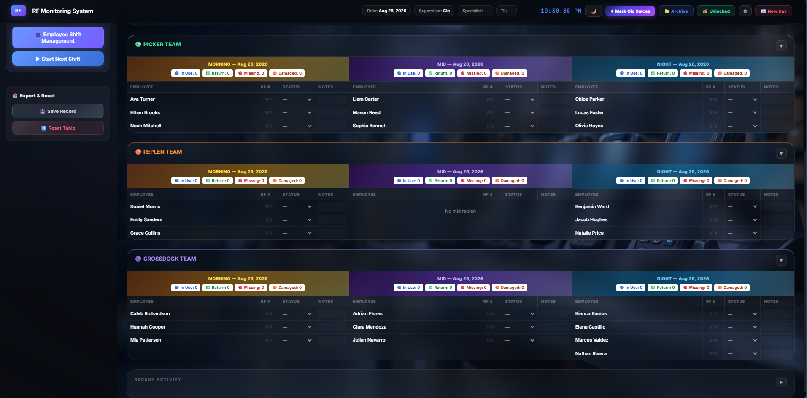

# RF Monitoring System – Portfolio Case Study

An AI-assisted warehouse RF monitoring dashboard designed to improve equipment accountability, assignment tracking, and shift visibility.

> **Result:** Since the dashboard was launched, the operation has recorded no missing RF units.

> **Privacy notice:** All names and records shown in this repository are fictional sample data. No company credentials, internal URLs, production records, or employee information are included.

## Business Problem

When I joined the warehouse operation, missing RF units were a recurring concern.

RF assignments were recorded manually on paper. Because the records could be edited or become difficult to trace, supervisors had limited visibility into:

* Who received each RF unit
* Which department and shift were using it
* Whether the assigned RF unit had been returned
* Which units were missing or damaged
* Who performed each update

The paper-based process made accountability and investigation difficult.

## The Idea

I proposed replacing the paper-based monitoring process with a digital dashboard that could provide clearer accountability and real-time visibility of RF unit status.

I designed the workflow based on the actual process used by the Picking, Replenishment, and Crossdock teams.

## Solution

I built an RF Monitoring System through AI-assisted development. The dashboard allows authorized operational users to:

* Assign RF units to employees
* Track Available, In Use, Missing, and Damaged statuses
* Organize assignments by department and shift
* Search for employee assignments
* View the availability of all RF units
* Identify missing or damaged equipment
* Record recent activities and status changes
* Save and review daily monitoring records
* Archive previous operational records
* Export monitoring information
* Restore locally saved information after an unexpected browser or computer restart

## Dashboard Preview

### RF Status Overview

### Department and Shift Monitoring

## Development Approach

I built the dashboard through AI-assisted development. Claude generated the underlying HTML, CSS, and JavaScript based on the operational requirements and detailed instructions I provided.

I did not manually write most of the source code. My role was to translate the warehouse process into system requirements, review each generated version, test the functions, identify errors, request corrections, and validate whether the dashboard worked correctly during actual operations.

The dashboard was introduced as a working pilot while development continued. Users were allowed to test it during operations and report errors, usability concerns, and additional requirements.

I continuously tested, debugged, and improved the system through detailed prompts and repeated validation.

## My Contribution

* Identified the recurring problem involving missing RF units
* Analyzed the weaknesses of the paper-based monitoring process
* Proposed a digital monitoring solution
* Mapped the existing RF assignment and return process
* Designed the required dashboard workflow and features
* Created detailed requirements and prompts for Claude
* Reviewed and tested the AI-generated application
* Identified bugs, incorrect behavior, and missing functions
* Guided revisions through repeated prompting and testing
* Gathered feedback from operational users
* Deployed the dashboard as a working pilot
* Continued improving the system based on actual operational use
* Monitored the results after implementation

## Business Impact

* Replaced editable paper-based RF assignment records
* Improved accountability for issued equipment
* Provided real-time visibility of RF availability
* Made missing and damaged units easier to identify
* Improved monitoring across departments and shifts
* Supported faster investigation of unreturned equipment
* Improved the traceability of RF assignments
* Recorded zero missing RF units after implementation

## Technology and Methods

* AI-assisted application development using Claude
* HTML, CSS, and JavaScript generated through AI
* Browser local storage
* Requirements gathering
* Warehouse process analysis
* User acceptance testing
* Iterative debugging and improvement
* User feedback collection
* Operational pilot implementation
* Continuous process improvement

## Current Limitations

* The dashboard uses browser local storage instead of a centralized database
* The editing lock is a user-interface control and not enterprise authentication
* Data is stored on the device and browser where the dashboard is used
* A future version could use a secure cloud database and organization-managed user accounts

## Portfolio Disclaimer

This public repository is a sanitized portfolio case study containing documentation and fictional-data screenshots only.

The production source code, company records, real employee information, credentials, passwords, and internal system information are not publicly included.
